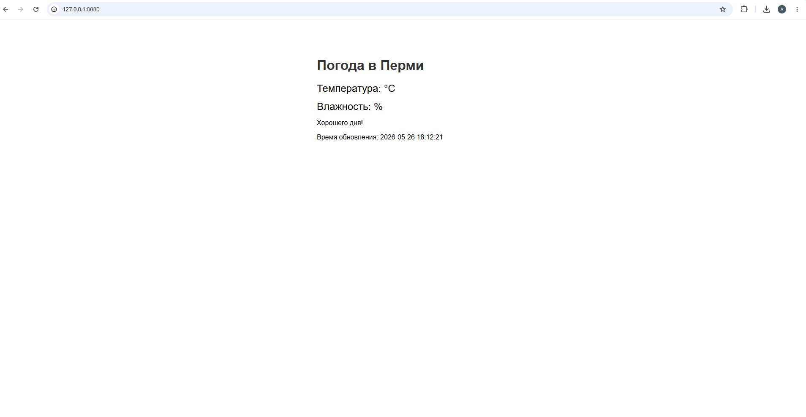

# GetWeather
Gettin weather from the wttr.in

A program that receives API data from the vttr.in resource and displays weather data for Perm via a local host.

In order for this script to run, you need to download the following resources

```bash
$ sudo apt install jq nginx cron
```

The following files need to be created

weather.sh - A bash file that receives data from the vttr.in API and creates a html file with weather inform

shedule_crontab - Runs a file on a schedule once per minute.

index.nginx-debian.html - the file that is created by our script


